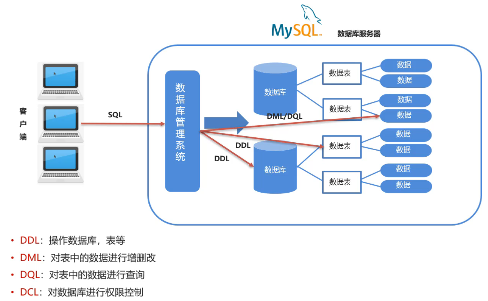
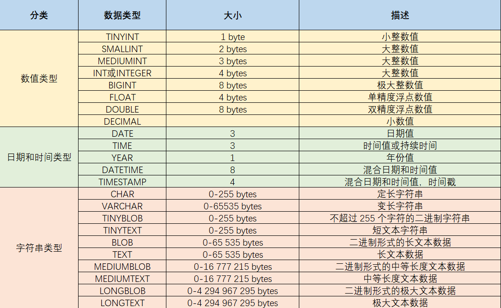
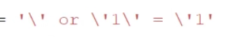
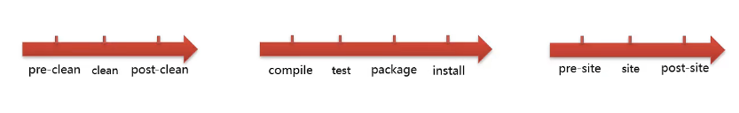
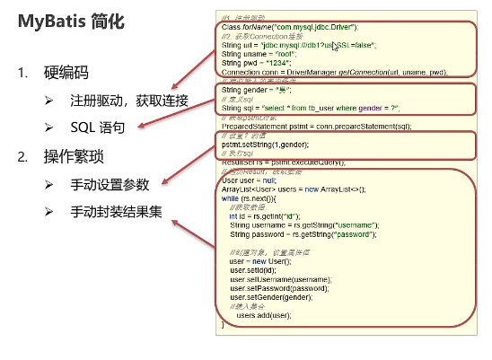
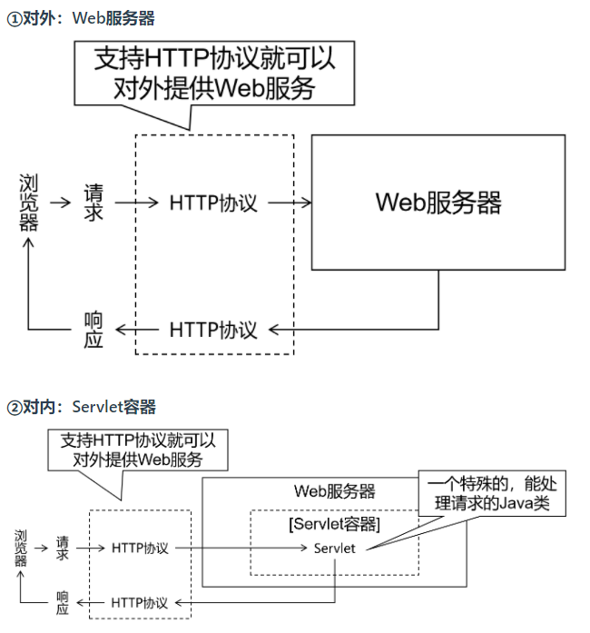
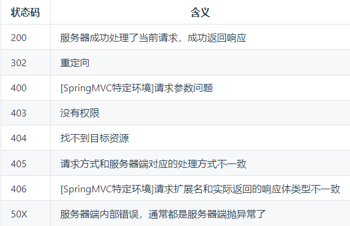

# JavaWeb

网页：展现数据
数据库：存储和管理数据
JavaWeb：逻辑处理，连接网页和数据库

# MySql

不区分大小写

**DDL**	操作数据库，表等
**DML**	对表中的数据进行增删改
**DQL**	对表中的数据进行查询
**DCL**	对数据库进行权限控制



### 数据类型

MySQL 支持多种类型，可以分为三类：

* 数值

  ```sql
  tinyint : 小整数型，占一个字节
  int	： 大整数类型，占四个字节
  	eg ： age int
  double ： 浮点类型
  	使用格式： 字段名 double(总长度,小数点后保留的位数)
  	eg ： score double(5,2)   
  ```

* 日期

  ```sql
  date ： 日期值。只包含年月日
  	eg ：birthday date ： 
  datetime ： 混合日期和时间值。包含年月日时分秒
  ```

* 字符串

  ```sql
  char ： 定长字符串。
  	优点：存储性能高
  	缺点：浪费空间
  	eg ： name char(10)  如果存储的数据字符个数不足10个，也会占10个的空间
  varchar ： 变长字符串。
  	优点：节约空间
  	缺点：存储性能底
  	eg ： name varchar(10) 如果存储的数据字符个数不足10个，那就数据字符个数是几就占几个的空间
  ```



## DDL -- 操作数据库

```sql
# 查询
SHOW DATABASES;
# 创建
CREATE DATABASE 数据库名称;
CREATE DATABASE IF NOT EXISTS 数据库名称;
# 删除
DROP DATABASE 数据库名称;
DROP DATABASE IF EXISTS 数据库名称
# 使用数据库
USE 数据库名称
```

## DDL -- 操作表

- 查询

```sql
# 查询当前数据库下所有表的名称
SHOW TABLES;
# 查询表结构
DESC 表名称;
```

- 创建

```sql
CREATE TABLE 表名 (
    字段名	数据类型,
    .......
);
```

- 删除

```sql
# 删除表
DROP TABLE 表名;
DROP TABLE IF EXISTS 表名;
```

- 修改表

```sql
# 修改表名
ALTER TABLE 表名 RENAME TO 新的表名;
# 添加一列
ALTER TABLE 表名 ADD 列名 数据类型;
# 修改数据类型
ALTER TABLE 表名 MODIFY 列名 新数据类型;
# 修改列名和数据类型
ALTER TABLE 表名 CHANGE 列名 新列名 新数据类型;
# 删除列
ALTER TABLE 表名 DROP 列名;
```

## DML -- 操作表(增删改)

- 添加表

```SQL
# 给指定行添加数据
INSERT INTO 表名(列1, 列2,...) VALUES(V1,V2,...);
# 给全部行添加数据
INSERT INTO 表名 VALUES(V1,V2);
```

```sql
# 例：添加数据
INSERT INTO stu (id,NAME,sex,birthday,score,email,tel,STATUS) VALUES (2,'李四','男','1999-11-11',88.88,'lisi@itcast.cn','13888888888',1);
```

注意：添加时，列名列名可以省略。但是建议不要省略

- 修改表

```sql
UPDATE 表名 SET 列名1=值1,列名2=值2,… [WHERE 条件] ;
```

```sql
update stu set birthday = '1999-12-12', 
				score = 99.99 
where name = '张三';
```

注意：修改语句中如果不加条件，则将所有数据都修改！

- 删除表中数据

```sql
DELETE FROM 表名 [WHERE 条件];
```

## DQL -- 操作表(查)

```sql
SELECT		#字段列表
FROM		#表名列表 
WHERE		#条件列表
GROUP BY	#分组字段
HAVING		#分组后条件
ORDER BY	#排序字段
LIMIT		#分页限定
```

——具体参见MySql笔记——

## 约束

约束是作用与表中列上规则，用于限制表中数据

约束的存在保证了数据库的数据正确性、有效性、完整性

```sql
例：
-- 员工表
CREATE TABLE emp (
	id INT,  -- 员工id，主键且自增长
    ename VARCHAR(50), -- 员工姓名，非空且唯一
    joindate DATE,  -- 入职日期，非空
    salary DOUBLE(7,2),  -- 工资，非空
    bonus DOUBLE(7,2)  -- 奖金，如果没有将近默认为0
);
```

* **非空约束： 关键字是 NOT NULL**

  保证列中所有的数据不能有null值。

  例如：id列在添加 `马花疼` 这条数据时就不能添加成功。

* **唯一约束：关键字是  UNIQUE**

  保证列中所有数据各不相同。

  例如：id列中三条数据的值都是1，这样的数据在添加时是绝对不允许的。

* **主键约束： 关键字是  PRIMARY KEY**

  主键是一行数据的唯一标识，要求非空且唯一。一般我们都会给没张表添加一个主键列用来唯一标识数据。

  例如：上图表中id就可以作为主键，来标识每条数据。那么这样就要求数据中id的值不能重复，不能为null值。

* **检查约束： 关键字是  CHECK** 

  保证列中的值满足某一条件。

  例如：我们可以给age列添加一个范围，最低年龄可以设置为1，最大年龄就可以设置为300，这样的数据才更合理些。

  > 注意：MySQL不支持检查约束。
  >

* **默认约束： 关键字是   DEFAULT**

  保存数据时，未指定值则采用默认值。

  例如：我们在给english列添加该约束，指定默认值是0，这样在添加数据时没有指定具体值时就会采用默认给定的0。

* **外键约束： 关键字是  FOREIGN KEY**

  外键用来让两个表的数据之间建立链接，保证数据的一致性和完整性。

```sql
# 建表和添加语句
-- 订单表
CREATE TABLE tb_order(
	id int primary key auto_increment,
	payment double(10,2),
	payment_type TINYINT,
	status TINYINT
);

-- 商品表
CREATE TABLE tb_goods(
	id int primary key auto_increment,
	title varchar(100),
	price double(10,2)
);

-- 订单商品中间表
CREATE TABLE tb_order_goods(
	id int primary key auto_increment,
	order_id int,
	goods_id int,
	count int
);

-- 建完表后，添加外键
alter table tb_order_goods add CONSTRAINT fk_order_id FOREIGN key(order_id) REFERENCES tb_order(id);
alter table tb_order_goods add CONSTRAINT fk_goods_id FOREIGN key(goods_id) REFERENCES tb_goods(id);
```

## 表间关系

- 一对一

直接通过外键约束连接

- 一对多

通过外键连接将“多”端连接至“一”端

- 多对多

在两表间创建新表，存储连接条件

## 事务

数据库的事务（Transaction）是一种机制、一个操作序列，包含了==一组数据库操作命令==。

事务把所有的命令作为一个整体一起向系统提交或撤销操作请求，即这一组数据库命令==要么同时成功，要么同时失败==。

事务是一个不可分割的工作逻辑单元。

### 事物的四大特征

* 原子性（Atomicity）: 事务是不可分割的最小操作单位，要么同时成功，要么同时失败

* 一致性（Consistency） :事务完成时，必须使所有的数据都保持一致状态

* 隔离性（Isolation） :多个事务之间，操作的可见性

* 持久性（Durability） :事务一旦提交或回滚，它对数据库中的数据的改变就是永久的

# JDBC

JDBC（Java DataBase Connectivity）
即用Java语言操作关系型数据库的一套API

JDBC是一套标准接口，MySql、Oracle等数据库提供各自的实现类jar包。

## JDBC基本操作

```java
//1.注册驱动
Class.forName("com.mysql.jdbc.Driver");//需要抛异常

//2.获取连接
String url = "jdbc:mysql://127.0.0.1:3306/mydatabase";
String username = "root";
String password = "951esz753";
Connection connect = DriverManager.getConnection(url,username,password);

//3.定义sql语句
String sql = "update bank set money = 1596 where id = 1";

//4.获取执行sql的对象Statement
Statement state = connect.createStatement();

//5.执行sql
int count = state.executeUpdate(sql);

//6.处理结果
System.out.println(count);

//7.释放资源
state.close();
connect.close();
```

## API

### DriveManager

驱动管理类。
作用：1.注册驱动	2.获取数据库连接

- 注册驱动

`Class.forName("com.mysql.jdbc.Driver");`

我们查询MySQL提供的Driver类，看它是如何实现的，源码如下：


在该类中的静态代码块中已经执行了 `DriverManager` 对象的 `registerDriver()` 方法进行驱动的注册了，那么我们只需要加载 `Driver` 类，该静态代码块就会执行。而 `Class.forName("com.mysql.jdbc.Driver");` 就可以加载 `Driver` 类。

- 获取数据库连接

url ： 连接路径

> 语法：jdbc:mysql://ip地址(域名):端口号/数据库名称?参数键值对1&参数键值对2…
>
> 示例：jdbc:mysql://127.0.0.1:3306/db1
>
> ==细节：==
>
> * 如果连接的是本机mysql服务器，并且mysql服务默认端口是3306，则url可以简写为：jdbc:mysql:///数据库名称?参数键值对
>
> * 配置 useSSL=false 参数，禁用安全连接方式，解决警告提示

### Connection

Connection（数据库连接对象）
作用：1.获取执行 SQL 的对象	2.管理事务

* 获取执行 SQL 的对象

**普通执行SQL对象**

```sql
Statement createStatement()
```

入门案例中就是通过该方法获取的执行对象。


**预编译SQL的执行SQL对象：防止SQL注入**

```sql
PreparedStatement  prepareStatement(sql)
```

通过这种方式获取 `PreparedStatement` SQL语句执行对象，它可以防止SQL注入。

* 管理事务

```sql
开启事务 ： BEGIN; 或者 START TRANSACTION;
提交事务 ： COMMIT;
回滚事务 ： ROLLBACK;
```

MySQL默认自动提交事务

```java
try {
// ============开启事务==========
conn.setAutoCommit(false);
//5. 执行sql
int count1 = stmt.executeUpdate(sql1);//受影响的行数
//6. 处理结果
System.out.println(count1);
int i = 3/0;
//5. 执行sql
int count2 = stmt.executeUpdate(sql2);//受影响的行数
//6. 处理结果
System.out.println(count2);

// ============提交事务==========
//程序运行到此处，说明没有出现任何问题，则需求提交事务
conn.commit();
} catch (Exception e) {
// ============回滚事务==========
//程序在出现异常时会执行到这个地方，此时就需要回滚事务
conn.rollback();
e.printStackTrace();
}
```

### Statement

执行SQL语句。针对不同的SQL语句使用不同的方法。

- 执行DML、DDL语句

`executeUpdate(String sql)`	执行给定的SQL语句，这可能是INSERT、UPDATE、DELETE语句，或者不返回任何内容，如DDL语句的SQL语句。

- 执行DQL语句

`executeQuery(String sql)`	执行给定的SQL语句，返回单个Resultset对象

### ResultSet

结果集对象。封装了SQL查询语句的结果。

作用：存放SQL查询结果

`ResultSet`对象提供了操作查询结果数据的方法

```java
boolean next()
//将光标从当前位置向前移动一行并判断当前行是否为有效行
xxx getXxx(参数)
//获取数据
```

### PreparedStatement

作用：
1.预编译SQL语句并执行。
2.预防SQL注入。

#### SQL注入

通过操作输入来修改事先定义好的SQL语句，用以达到执行代码对服务器进行攻击的方法。

通俗讲，SQL注入就是利用**字符串的拼接**，人为的钻漏洞

例：在一些登录界面，如果输入密码`'or'1'='1`,则不论账号密码是否正确，直接实现登录。

#### PreparedStatement

* 获取 PreparedStatement 对象

  ```java
  // SQL语句中的参数值，使用？占位符替代
  String sql = "select * from user where username = ? and password = ?";
  // 通过Connection对象获取，并传入对应的sql语句
  PreparedStatement pstmt = conn.prepareStatement(sql);
  ```

* 设置参数值

  将sql语句中参数使用 ? 进行代替

  > PreparedStatement对象：setXxx(index，value)给 ? 赋值
  >
  > * index：第几个？，从1开始
  > * value：该？的值

* 执行SQL语句

  > executeUpdate();  执行DDL语句和DML语句
  >
  > executeQuery();  执行DQL语句
  >
  > 注意：调用这两个方法时不需要传递SQL语句，因为获取SQL语句执行对象时已经对SQL语句进行预编译了。

#### 原理

PreparedStatement通过**将敏感字符进行转义**来防止SQL注入

即通过反斜杠“\”：


**Java操作数据库的流程：**
1.检查SQL语句语法
2.编译SQL语句。将SQL语句编译成可执行的函数。
3.执行SQL语句

其中：**检查SQL和编译SQL花费的时间比执行SQL的时间还要长**。如果我们只是重新设置参数，那么检查SQL语句和编译SQL语句不需要重复执行。这样可以提高性能，这就引入了**预编译**。

开启预编译：在代码的url处加上`useServerPrepStmts = true`

## 数据库连接池

数据库连接池是个容器，负责分配、管理数据库连接(Connection)

它允许应用程序重复使用一个现有的数据库连接，而不是再重新建立一个；

释放空闲时间超过最大空闲时间的数据库连接来避免因为没有释放数据库连接而引起的数据库连接遗漏

**好处：资源重用、提升系统响应速度、避免数据库连接遗漏**

### 实现

标准接口：DataSource

官方(SUN) 提供的数据库连接池标准接口，由第三方组织实现此接口。该接口提供了获取连接的功能：

```java
Connection getConnection()
```

那么以后就不需要通过 `DriverManager` 对象获取 `Connection` 对象，而是通过连接池（DataSource）获取 `Connection` 对象。

常见的数据库连接池
Druid（德鲁伊）	阿里巴巴开源的数据库连接池项目

# Maven

Maven是一个项目管理和构建的工具

- 提供了一套标准化的项目结构
- 提供了一套标准化的构建流程（编译，测试，打包，发布......)
- 提供了一套依赖管理机制

## 生命周期

生命周期描述的是一次构建过程经历了多少个时间

Maven将项目生命周期的划分为3套
		clean		清洁工作
		default	 核心工作
		site			产生报告，发布站点

注意：同一周期内，执行后面的命令，前面的所有命令都会自动执行



## Maven命令


## 坐标

Maven中的坐标是**资源的唯一标识**，使用坐标来定义项目或引入项目所需的依赖。

**Maven 坐标主要组成**

* groupId：定义当前Maven项目隶属组织名称
* artifactId：定义当前Maven项目名称
* version：定义当前项目版本号

```xml
<!--当前项目坐标-->
    <groupId>org.example</groupId>
    <artifactId>maven_demo</artifactId>
    <version>1.0-SNAPSHOT</version>

    <!--导入mysql  驱动jar包-->
    <dependencies>
        <dependency>
            <groupId>mysql</groupId>
            <artifactId>mysql-connector-java</artifactId>
            <version>5.1.32</version>
        </dependency>
        <dependency>
            <groupId>junit</groupId>
            <artifactId>junit</artifactId>
            <version>4.12</version>
        </dependency>
    </dependencies>
```

## 依赖

即，使用坐标来描述当前项目依赖哪儿些第三方jar包

**Dependency**

### 依赖范围

即对应jar包的作用范围（编译环境、测试环境、运行环境）

**Scope**

scope取值

| **依赖范围** | 编译classpath | 测试classpath | 运行classpath | 例子              |
| ------------ | ------------- | ------------- | ------------- | ----------------- |
| **compile**  | Y             | Y             | Y             | logback           |
| **test**     | -             | Y             | -             | Junit             |
| **provided** | Y             | Y             | -             | servlet-api       |
| **runtime**  | -             | Y             | Y             | jdbc驱动          |
| **system**   | Y             | Y             | -             | 存储在本地的jar包 |

* compile ：作用于编译环境、测试环境、运行环境。
* test ： 作用于测试环境。如Junit
* provided ：作用于编译环境、测试环境。
* runtime  ： 作用于测试环境、运行环境。jdbc驱动一般将 `scope` 设置为该值

# MyBatis

MyBatis是一款持久层框架，**用于简化JDBC开发**

MyBatis几乎免除了所有的JDBC代码以及设置参数和获取结果集的工作

**框架：通用的软件基础代码模型**
**持久层：负责将数据保存到数据库的代码**
**JavaEE三层框架：表现层、业务层、持久层**

## JDBC缺点



解决硬编码的方式：在程序外建立**配置文件XML**，专门用来存放重要的字符串等信息

## MyBatis基本操作

步骤：

```txt
1.创建user表，添加数据
2.创建模块，导入坐标
3.编写MyBatis核心配置文件--替换连接信息解决硬编码问题
4.编写SQL映射文件--统一管理sql语句，解决硬编码问题
5.编码
		定义POJO类
		加载核心配置文件，获取SqlSessionFactory 对象
		获取SqlSession对象，执行SQL语句
		释放资源
```

**入门官网**
https://mybatis.org/mybatis-3/zh/getting-started.html

# HTML

html语言是解释性语言，不是编译型语言(Java等)。
浏览器是容错的。

## 标签

html页面由标签组成，如`<html></html>`

一个简单的html页面必须有`<head>...</head>`、`<body>...<\body>`

- title	网页标题

```html
<title>这是我的第一个网页</title>
```

- meta	设置字符集（编码方式）

```html
<meta charset="UTF-8">
```

- br/	换行

```html
HELLO WORLD!<br/>你好，HTML！
```

- p	段落标签

```html
<p>这里是一个段落</p>
```

- img 标签图片标签
  	src属性表示图片文件的路径
  	width和height表示图片的大小
  	alt表示图片的提示

```html

```

- h1~h6	标题标签

```html
<h1>标题一</h1>
```

- 列表标签:
  - ol 有序列表
  	start 表示从*开始，type 显示的类型：A a I i 1(deafult)
  - ul 无序列表
  	type disc(default) , circle , square

```html
<ol type="i" start="3">
<li>扫地僧</li>
<li>萧远山</li>
<li>慕容博</li>
<li>虚竹</li>
<li>阿紫</li>
</ol>
```

- u 下划线
- b 粗体
- i 斜体

```html
你是<b><i><u>喜欢</u></i></b>吃<b>甜</b>月饼还是<i>咸</i><u>月饼</u>？
```

- 上标 sup   下标 sub

- 小于号 `&lt;` 大于等于号` &ge;`

- a 表示超链接
  		href 链接的地址
    		target:
    			_self 在本窗口打开
    			_blank 在一个新窗口打开
    			_parent 在父窗口打开
    			_top  在顶层窗口打开

```html
<a href="http://www.baidu.com" target="_self">百度一下</a>
```

- div	层

- table	表格

行		tr
列		td
表头列	th

table中有如下属性（虽然已经淘汰，但是最好了解一下）

border：表格边框的粗细
width:表格的宽度
cellspacing：单元格间距
cellpadding：单元格填充

tr中有一个属性： align -> center , left , right 

rowspan : 行合并
colspan : 列合并

```html
<table border="1" cellspacing="0" cellpadding="4" width="600">
			<tr>
				<th>名称</th>
				<th>单价</th>
				<th>数量</th>
				<th>小计</th>
				<th>操作</th>
			</tr>
			<tr align="center">
				<td>苹果</td>
				<td rowspan="2">5</td>
				<td>20</td>
				<td>100</td>
				<td></td>
			</tr>
			<tr align="center">
				<td>菠萝</td>
				<td>15</td>
				<td>45</td>
				<td></td>
			</tr>
			<tr align="center">
				<td>总计</td>
				<td colspan="4">181</td>
			</tr>
</table>
```

- 表单	form

```html
<form action="demo04.html" method="post">
		昵称：<input type="text" value="请输入你的昵称"/><br/>
		密码：<input type="password" name="pwd"/><br/>
		性别：<input type="radio" name="gender" value="male"/>男
	  		<input type="radio" name="gender" value="female" checked/>女<br/>
		爱好：<input type="checkbox" name="hobby" value="basketball"/>篮球
			<input type="checkbox" name="hobby" value="football" checked/>足球
			<input type="checkbox" name="hobby" value="earth" checked/>地球<br/>
		星座：<select name="star">
				<option value="1">白羊座</option>
				<option value="2" selected>金牛座</option>
				<option value="3">双子座</option>
				<option value="4">天蝎座</option>
				<option value="5">天秤座</option>
				</select><br/>
		备注：<textarea name="remark" rows="4" cols="50"></textarea><br/>
		<input type="submit" value=" 注 册 "/>
		<input type="reset" value="重置"/>
		<input type="button" value="这是一个普通按钮"/>
</form>
```

# CSS

CSS 决定页面的美观风格

盒子模型：border边框、margin间距、padding填充

定位和浮动：position、float、DIV + CSS布局

https://heavy_code_industry.gitee.io/code_heavy_industry/pro001-javaweb/lecture/chapter02/

# JavaScript

JS是客户端运行的脚本语句

特点：
1.JS是一种弱类型语言	如：`var str = 99;`
2.JS函数	如：`function hello(var num) {...}`

# CS & BS

**CS	客户端服务器架构模式**

- 优点：

  充分利用客户端机器的资源，减轻服务器负荷。

  一部分安全性要求不高的计算任务和存储任务放在客户端执行，不需要把所有的计算和存储都在服务器端执行，从而能减轻服务器压力，并且减轻网络负荷。

- 缺点：

  需要安装，升级维护成本高

**BS	浏览器端服务器框架模式**

- 优点：

  客户端不需要安装；维护成本低

- 缺点：

  所有的计算和存储任务都是放在服务器端的，服务器的负荷较重；在服务器计算完成之后把结果再传给客户端，因此客户端和服务器端会进行频繁的数据通信，从而网络负荷较重

# Tomcat

## XML

XML和HTML一样都是标记语言，也就是说它们的基本语法都是标签。

**注意：**
语法上HTML和XML基本一致
在逻辑上**HTML确实是XML的子集**。

## Tomcat

Tomcat可作为**Web服务器**和**Servlet容器**



### Tomcat 设置字符集

`request.setCharacterEncoding("UTF-8");`

注意：设置编码(post)这一句代码必须在所有的获取参数动作之前

# Servlet

- 继承关系

​	HttpServlet -> GenericServlet -> Servlet

- 方法

```java
void init(config)				//初始化方法
void service(request,response)	//服务方法
void destory()					//销毁方法
```

- 服务方法

​	service方法会自动响应收到的请求。

在HttpServlet中我们会去分析请求的方式：get、post、head、delete等等然后再决定调用的是do开头的方法。（doPost）

HttpServlet中do方法默认都是405实现风格，需要子类实现对应方法，否则报错405。

## Servlet生命周期

**生命周期**	从出生到死亡的过程。
对应`init()`,`service()`,`destroy()`

默认情况下：
**第一次接收请求时，Servlet会进行实例化(调用构造方法)、初始化(调用init())、然后服务(调用service())**。从第二次请求开始，每一次都是服务。
优点：提高系统响应速度
缺点：第一次请求耗时较长

当容器关闭时，其中的servlet实例会被销毁

如果需要提高响应速度，我们应该设置Servlet的初始化时机。通过`<load-on-startup>`来设置servlet启动顺序,数字越小，启动越靠前，最小值0。

## Servlet 特点

Servlet在容器中是：**单例的**、**线程不安全的**

- 单例：所有的请求都是同一个实例去响应
- 不安全：一个线程需要根据这个实例中的某个成员变量值做逻辑判断。但是在中间某个时机，另一个线程改变了这个成员变量的值，从而导致第一个线程的执行路径发生了变化

尽量不要在servlet中定义成员变量。
如果定义了成员变量①不要修改成员变量值 ②不要根据成员变量值进行判断

# HTTP

HTTP：**H**yper **T**ext **T**ransfer **P**rotocol **超文本传输协议**。

HTTP最大的作用就是确定了**请求**和**响应**数据的格式。

HTTP是**无状态**的

## 请求和响应

- 浏览器发送给服务器的数据：请求报文

- 服务器返回给浏览器的数据：响应报文

> 一个请求包含：请求行、请求消息头、请求主体
>
> 
>
> - 请求行：请求方式、访问地址、HTTP协议的版本
>
> - 请求体：
>
>   get	从服务器获取数据，没有请求体，有queryString
>
>   post	将数据保存到服务器端，有请求体，form data

> 响应也包含三本： 1.响应行 2.响应头 3.响应体
>
> 
>
> - 响应行包含三个信息：1.协议 2.响应状态码(200) 3.响应状态(ok)
> - 响应头：包含了服务器的信息；服务器发送给浏览器的信息（内容的媒体类型、编码、内容长度等）
> - 响应体：响应的实际内容

## 响应状态码

以编码的形式报告当前请求处理的结果



404产生的具体原因：

- 访问地址写错了，确实是没有这个资源
- 访问了WEB-INF目录下的资源
- Web应用启动的时候，控制台已经抛出异常，导致整个Web应用不可用，访问任何资源都是404
- 服务器端缓存

## 会话(session)

- HTTP 无状态

**服务器无法判断多次请求的发送端是一个客户端还是多个客户端**

- 会话跟踪技术

客户第一次发送请求给服务器，服务器获取session，如果没有，则创建一个新的并响应给服务器端。因此每个客户端都会有一个独立的sessionID

- session保存作用域 

session保存作用域是和具体的某一个session对应的。
如：在chrome内部执行的session不能在IE中执行，因为IE中的session并不是chrome中的session

### 服务器内部转发和客户端重定向

- 服务器内部转发

一次请求相应的过程，客户端不知道服务器端内部进行了多少次转发。

特点：地址栏没有变化

- 客户端重定向

两次请求相应的过程，客户端知道改变了请求url

特点：地址栏有变化

### Thymoleaf -- 视图模板技术

