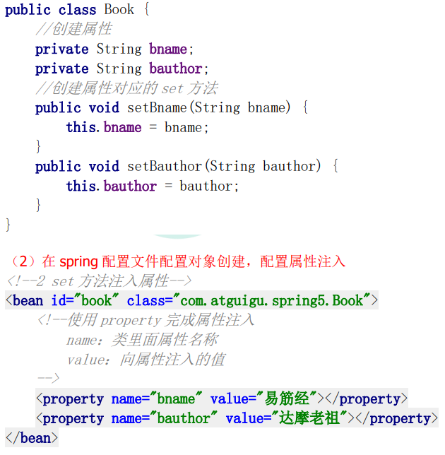
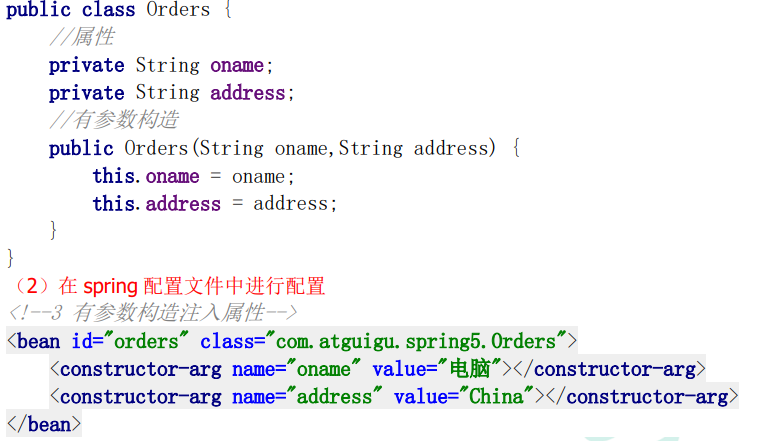
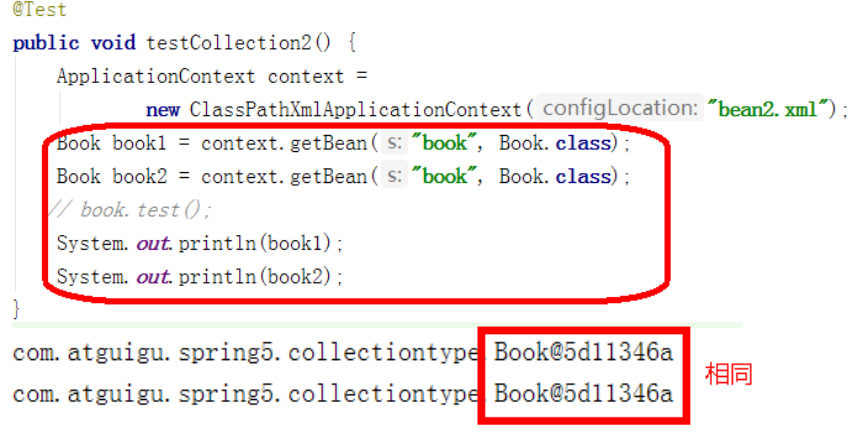
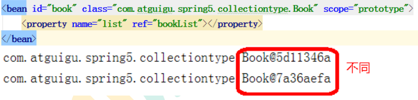

# Spring

Spring框架是开源的J2EE应用程序框架，是**针对bean的生命周期**进行管理的轻量级**容器**。用于**降低企业应用开发的复杂性，方便解耦**

- Spring有两个核心部分：IOC和Aop

**IOC	控制反转，把创建对象和调用对象的过程交给Spring管理**
**Aop	面向切面，不修改源代码进行功能增强**

## IOC

**底层原理：**
**xml解析、工厂模式、反射**

Spring 提供 IOC 容器实现两种方式：（两个接口）

（1）BeanFactory：IOC容器基本实现，是 Spring内部的使用接口，不提供开发人员进行使用 		加载配置文件时候不会创建对象，在获取对象（使用）才去创建对象 
（2）ApplicationContext：BeanFactory接口的子接口，提供更多更强大的功能，一般由开发人员进行使用
		加载配置文件时候就会把在配置文件对象进行创建

### Bean管理（xml）

> Bean管理指的是两种操作
> 1.Spring创建对象	2.Spring注入属性

> Bean管理的**操作方式**
> 1.基于**xml配置文件**实现	2.基于**注解**实现

#### 基于**xml配置文件**实现

1.创建对象

`<bean id = "user" class = "myProject.User"></bean>`

- 在 Spring 配置文件中，使用 bean 标签，标签里面添加对应属性，就可以实现对象创建
- 在 bean 标签常用属性

​		id 属性：唯一标识		class 属性：类全路径（包类路径）

- 默认执行无参数构造方法完成对象创建

2.注入属性

通过依赖注入（DI），就是注入属性

> 第一种注入方法：**set方法注入**
>
> 
>
> 第二种注入方法：**有参构造注入**
>
> 

#### xml注入其他类型属性

- null	`<null/>`

- 特殊符号	`<![CDATA[<<南京>>]]>`

​		也可以将<>进行转义 `&lt`、`&gt`

------

**外部bean**

```xml
<bean id = "userService" class = "service.UserService">
    <!--注入 userDao 对象
     name 属性：类里面属性名称
     ref 属性：创建 userDao 对象 bean 标签 id 值-->
    <property name = "userDao" ref = "userDaoImpl"></property>
</bean>
<bean id = "userDaoImpl" class = "dao.UserDaoImpl"></bean>
```

**内部bean**

```xml
<bean id="emp" class="com.atguigu.spring5.bean.Emp">
     <!--设置两个普通属性-->
     <property name="ename" value="lucy"></property>
     <property name="gender" value="女"></property>
    
     <!--设置对象类型属性-->
     <property name="dept">
         <bean id="dept" class="com.atguigu.spring5.bean.Dept">
         <property name="dname" value="安保部"></property>
         </bean>
     </property>
</bean>
```

**级联赋值**

```xml
<bean id="emp" class="com.atguigu.spring5.bean.Emp">
     <!--设置两个普通属性-->
     <property name="ename" value="lucy"></property>
     <property name="gender" value="女"></property>
     <!--级联赋值-->
     <property name="dept" ref="dept"></property>
</bean>

<bean id="dept" class="com.atguigu.spring5.bean.Dept">
     <property name="dname" value="财务部"></property>
</bean>
```

#### xml注入集合属性

```xml
<bean id="stu" class="collectiontype.Stu">
     <!--数组类型属性注入-->
     <property name="courses">
         <array>
         <value>java 课程</value>
         <value>数据库课程</value>
         </array>
     </property>
     <!--list 类型属性注入-->
     <property name="list">
         <list>
         <value>张三</value>
         <value>小三</value>
         </list>
     </property>
     <!--map 类型属性注入-->
     <property name="maps">
         <map>
         <entry key="JAVA" value="java"></entry>
         <entry key="PHP" value="php"></entry>
         </map>
     </property>
     <!--set 类型属性注入-->
     <property name="sets">
         <set>
         <value>MySQL</value>
         <value>Redis</value>
         </set>
     </property>
</bean>
```

- 使用util标签完成list

#### FactoryBean

Spring中有两种bean，**普通bean**和**工厂bean（FactoryBean）**

- **普通bean：在配置中定义bean类型和返回值类型相同**
- **工厂bean：在配置文件中定义的bean类型和返回值类型不同**

#### 单实例和多实例

在Spring中，创建bean实例默认是**单实例**



- scope属性：用于设置单实例/多实例

**`scope = singleton`	表示单实例**

**`scope = prototype`	表示多实例**



- singleton 和 prototype 区别

1.singleton 单实例，prototype 多实例
2.**`scope = singleton` 时，加载 spring 配置文件时会创建单实例对象**
   **`scope = prototype` 时，加载 spring 配置文件时不创建对象，而在调用 getBean 方法时候创建多实例对象**

#### bean生命周期

从对象创建到销毁的过程

> bean生命周期
>
> 1.通过构造器创建bean实例
> 2.设置属性值（调用set方法）
> 3.执行初始化方法
> 4.获取bean实例对象
> 5.容器关闭时，调用bean的销毁方法

#### xml自动装配

根据装配规则，Spring自动将匹配的属性值进行注入

bean标签属性**autowire**，配置自动装配

> autowire常用值：
>
> 1. **byName** 根据属性名称注入
>
> 2. **byType**   根据属性类型注入

### Bean管理（注解）

注解：
（1）注解是代码特殊标记
（2）使用注解，注解可以作用在类上面，方法上面，属性上面
（3）使用注解目的：简化 xml 配置

Spring针对Bean管理中创建对象提供注解
（1）**@Component**
（2）**@Service**
（3）**@Controller**
（4）**@Repository**
上面四个注解功能是一样的，都可以用来创建bean实例
