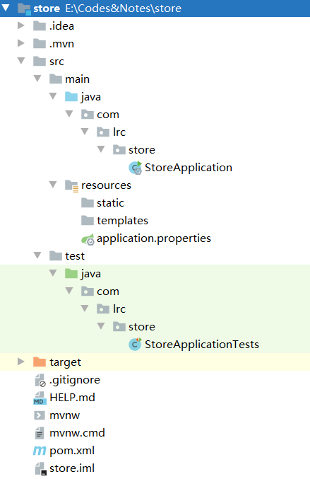
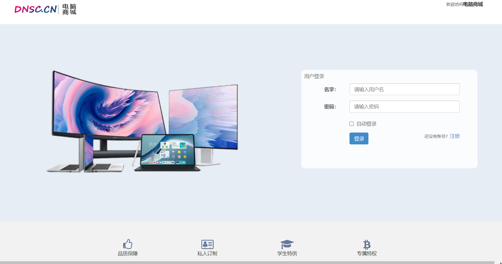
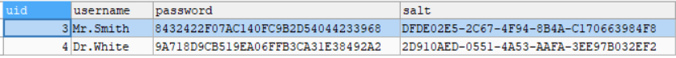

# 整体思路

## 系统和环境

操作系统：win10

JDK版本：1.8

项目管理工具：maven 3.0

IDE：IDEA 2020

数据库：MySQL 8.0

浏览器：Google Chrome

服务器架构：SSM、AJAX

## 项目功能

登录、注册、用户管理（密码、个人信息、头像收货地址）、购物车（展示、增加、删除）、订单模块、热销产品

## 数据种类

用户、商品、商品类别、收藏、订单、购物车、收货地址

## 开发思路

- 持久层：根据前端的设置，规划和配置SQL语句
- 业务层：核心功能控制、业务操作和异常处理
- 控制层：接收请求、处理响应



# 搭建项目

1.项目名称：store	结构：com.lrc.store

新建`Spring Initializr`项目，构建一个基础的SpringBoot项目

2.导入基础jar包

```
javaweb
mybatis
mysqldriver
```

3.在properties中配置数据库连接源信息

```properties
spring.datasource.url=jdbc:mysql://localhost:3306/store?useUnicode=true&\characterEncoding=utf-8&serverTimezone=Asia/Shanghai
spring.datasource.username=root
spring.datasource.password=123456
```

4.创建数据库并测试连接

- （后端）在单元测试类中测试数据库连接是否可以正常加载，通过注入数据元信息，获取数据库连接对象的信息

```java
@Autowired
private DataSource dataSource;//注入数据元信息

@Test
void getConnection() throws SQLException {
    System.out.println(dataSource.getConnection());
}
//HikariProxyConnection@1290795133 wrapping com.mysql.cj.jdbc.ConnectionImpl@3238e2aa

//Hikari:数据库连接池，管理数据库的连接对象
```

- （前端）访问项目静态资源是否可以正常加载，resourses.static存储静态资源



> 注意:
> IDEA对于JS代码的兼容性较差，js代码可能无法正常加载。
>
> 解决：
> 1.idea缓存清理
> 2.clear-instal
> 3.rebuild重新构建
> 4.重启idea和操作系统

5.数据库操作

```sql
# 用户表
uid INT AUTO_INCREMENT COMMENT '用户id',
username VARCHAR(20) NOT NULL UNIQUE COMMENT '用户名',
PASSWORD CHAR(32) NOT NULL COMMENT '密码',
salt CHAR(36) COMMENT '盐值',
phone VARCHAR(20) COMMENT '电话号码',
email VARCHAR(30) COMMENT '电子邮箱',
gender INT COMMENT '性别:0-女，1-男',
avatar VARCHAR(50) COMMENT '头像',
is_delete INT COMMENT '是否删除：0-未删除，1-已删除',
created_user VARCHAR(20) COMMENT '日志-创建人',
created_time DATETIME COMMENT '日志-创建时间',
modified_user VARCHAR(20) COMMENT '日志-最后修改执行人',
modified_time DATETIME COMMENT '日志-最后修改时间',

# 地址表
aid INT AUTO_INCREMENT COMMENT '收货地址id',
uid INT COMMENT '归属的用户id',
NAME VARCHAR(20) COMMENT '收货人姓名',
province_name VARCHAR(15) COMMENT '省-名称',
province_code CHAR(6) COMMENT '省-行政代号',
city_name VARCHAR(15) COMMENT '市-名称',
city_code CHAR(6) COMMENT '市-行政代号',
area_name VARCHAR(15) COMMENT '区-名称',
area_code CHAR(6) COMMENT '区-行政代号',
zip CHAR(6) COMMENT '邮政编码',
address VARCHAR(50) COMMENT '详细地址',
phone VARCHAR(20) COMMENT '手机',
tel VARCHAR(20) COMMENT '固话',
tag VARCHAR(6) COMMENT '标签',
is_default INT COMMENT '是否默认：0-不默认，1-默认',
created_user VARCHAR(20) COMMENT '创建人',
created_time DATETIME COMMENT '创建时间',
modified_user VARCHAR(20) COMMENT '修改人',
modified_time DATETIME COMMENT '修改时间',
```

# 用户注册

当用户输入用户名和密码后，数据库将获取到的信息与表中信息进行比对，若不存在该用户，则注册成功，并跳转至登录页面。注册按钮的电机事件在**前端使用AJAX**实现。

- **创建实体类**

`BaseEntity`
实体类基类,由于用户和收货地址都有一些共同的属性（创建时间、创建者、修改时间、修改者）

`User`
用户实体类

## 1.持久层

基础sql语句：

```sql
# 注册需要插入数据
insert into t_user(除了uid以外的字段列表) values(匹配的值列表)

# 判断当前用户名是否已经存在
select * from t_user where username = ?
```

1.创建UserMapper接口，创建接口对应的映射文件，遵循和接口名称保持一致即可，创建`UserMapper.xml`。

2.将接口中的方法对应到SQL语句，用标签完成。

- namespace属性:用于指定当前的映射文件和哪个接口进行映射，需要指定接口的文件路径。

- 定义映射接口的方法，在标签内部设置sql语句

运行过程：insert等sql标签对应的语句通过映射的接口和UserMapper内部方法对应，从而做到一一对应。

3.将mapper文件注册到properties配置文件中

```properties
mybatis.mapper-locations=classpath:mapper/*.xml
```

告诉mybatis本地的映射文件在哪

## 2.业务层

1.规划异常。由于业务层异常都是在运行时才会出现，因此`ServiceException`继承自`RuntimeException`

根据业务层不同的功能来详细定义具体的异常类型，统一的去继承`ServiceException`。

- 用户名已存在异常
- 添加用户信息异常（服务器、数据库宕机）

2.创建Service类，作为用户模块业务层实现类。包括用户注册的业务层方法，通过UserMapper实现与MySQL连接

3.用户密码加密

**md5算法**：
(**盐值 + password + 盐值**)，通过md5算法进行加密，连续加载三次。
**盐值：随机的字符串**



## 3.控制层

1.**创建响应**

`JsonResult`将**状态码**、**状态描述信息**、**数据**封装在一个类中，该类的返回值传送给浏览器。

2.处理请求

```txt
请求路径：/users/reg
请求参数：User user
请求类型：POST
响应结果：JsonResult<Void>
```

`UserController`将请求和处理请求的处理器关联起来，建立映射关系。每个操作完成后需要有状态码和描述信息。将响应结果以json格式进行数据响应给前端。

在类的声明前加`@RestController`、`@RequestMapping("user")`。前者为控制层注解和响应体注解的结合，后者建立了请求和处理请求的控制器方法的映射关系

```java
@RestController = @Controller + @ResponseBody，
@ResponseBody//表示此方法响应结果以json格式进行数据相应给前端
```

3.`BaseController`创建一个控制层基类作为控制层父类，当控制层方法产生异常时，父类中的`@ExceptionHandler`注解保证可以及时拦截异常，并将返回值直接给到前端控制器。

## 4.前端页面

在register页面中编写**发送请求**的方法，点击事件来完成。选选中对应的按钮**($("选择器")**，再去添加点击的事件

在register.html页面添加script标签用于编写JS程序。通过AJAX监听注册按钮是否被点击，如果被点击则执行特定方法：执行post请求，通过读入表单数据获取json格式数据。判断并弹出对话框。

# 用户登录

当用户提交用户名和密码到后台数据库，如果数据库中信息存在表示登录成功。跳转至系统主页`index.html`。跳转在**前端使用jquery**完成。

## 1.持久层

1.基础SQL语句：

```sql
select * from t_user where username = ?
```

已开发

2.接口和方法

已开发

3.配置SQL映射

已开发

## 2.业务层

1.异常规划

- 用户不存在`UserNotFoundException`

**用户名不存在**或**isDelete==1**

- 密码错误`PasswordNotMatchException`

继承`ServiceException`，并生成五个构造方法

2.接口和抽象方法

`IUserService`接口添加`login`抽象方法。参数列表为用户名和密码，返回值为User，因为在用户登录后，页面右上角一般会有用户的个人信息的部分展示，这里将个人信息直接作为返回值课提高开发效率。

3.方法实现

通过`findByUsername()`查询用户数据。若结果为null或isDelete==1则抛出`UserNotFoundException`。

获取`salt`值，调用`getMD5Passord()`获取加密后密码，并判断密码是否一致。

创建`User`对象，存储部分个人信息（id、用户名、头像），并返回该对象。

> **注意**：这里新建的user将展示在前端右上角，作为个人信息。**调优**
>
> **层与层的数据传输体量变小，**
> **后台的层与层之间调用，数据量越小效率越高。**
> **前后端传递信息时，数据量体量越小，响应速度越快。**
> **(调优)**
> **相当于变相完成了数据的中转和压缩**

## 3.控制层

1.处理异常

业务层抛出的异常是什么，需要在统一的异常处理类中进行统一的捕获和处理。

`BaseController`

2.设计请求

请求路径：/users/login
请求方式：POST
请求结果：String username,String password
响应结果：JsonResult<User>

3.处理请求

将数据以json格式响应到前端

`UserController`

## 4.登录前端

1.在`login.html`页面依据请求来发送ajax请求

# NEW

## Serializable

**序列化接口**，一个类只有实现了Serializable接口，它的对象才能被序列化。

- 序列化：序列化是将对象状态转换为可保持或传输的格式的过程。与序列化相对的是反序列化，它将流转换为对象。这两个过程结合起来，可以轻松地存储和传输数据。
- 把对象转换为字节序列的过程称为对象的**序列化**
  把字节序列恢复为对象的过程称为对象的**反序列化**

**应用场景：**

在定义**实体类**时，会选择继承Serializable接口。

当我们需要把对象的状态信息通过网络进行传输，或者需要将对象的状态信息持久化，需要把对象进行序列化。Serializable存储对象在存储介质中，以便在下次使用的时候，可以很快捷的重建一个副本。

**Serializable接口内部是空的，相当于一个标识接口。用于通知JVM将相应的类做序列化。**

- **serialversionUID**

serialVersionUID是用来辅助对象的序列化与反序列化的，原则上序列化后的数据当中的serialVersionUID与当前类当中的serialVersionUID一致，那么该对象才能被反序列化成功。这个serialVersionUID的详细的工作机制是：在序列化的时候系统将serialVersionUID写入到序列化的文件中去，当反序列化的时候系统会先去检测文件中的serialVersionUID是否跟当前的文件的serialVersionUID是否一致，如果一直则反序列化成功，否则就说明当前类跟序列化后的类发生了变化，

## @Data

`@Data`注解的主要作用是提高代码的简洁，使用这个注解可以省去代码中大量的`get()`、`set()`、`toString()`等方法

## DAO

用于持久层。负责与数据库联络的任务和方法都封装在此。

mapper层（即DAO层）：是对数据库进行数据持久化操作，他的方法语句是直接针对数据库操作的，用mybatis逆向工程生成。

设计思想：
首先设计DAO接口，然后定义此接口的实现类。通过Spring注解或配置文件实现DAO模块的调用，进行数据业务处理。

> DAO设计模式优点
> （1）DAO模式抽象出数据访问方式，业务逻辑层访问数据源时完全感觉不到数据源的存在。软件工厂中有一条很重要的法则：一个对象对其他对象的了解越少越好，了解越少就意味着依赖越少，可复用性越高。
>
> （2）DAO将数据访问集中在独立的一层，因为所有的数据访问都由DAO代理，这层独立的DAO将数据访问的实现和系统的其余部分剥离，将数据访问集中，使得系统更具可维护性。
>
> （3）DAO降低了业务逻辑层的复杂度。DAO管理复杂的数据访问，从而简化了业务逻辑层。所有与数据访问的实现有关的代码都不写在业务逻辑层里，业务逻辑层可集中处理业务逻辑，提高了代码的可读性和生产率。
>
> （4）DAO有助于提升系统的可移植性。DAO模式通过将数据访问划分为抽象层和实现层，分离数据使用和数据访问的实现细节。这意味着业务层与数据访问的底层细节无关，也就是说，可以在保持上层机构不变的情况下，通过切换底层实现来修改数据访问的具体机制，提高了系统的可复用性。

## JSON

JavaScript对象表示法（JavaScript Object Notation）

文本数据交换格式。

JSON 使用 JavaScript 语法来描述数据对象，但是 JSON 仍然独立于语言和平台。JSON 解析器和 JSON 库支持许多不同的编程语言。

> 数据格式
>
> - 格式：{ “key” : value}
> - 示例： {“key1”:100,“key2”:20}

## @RequestMapping

将请求和处理请求的控制器方法关联起来，建立映射关系。

SpringMVC接收到指定的请求，就会来找到在映射关系中对应的控制器方法来处理这个请求。

## @ExceptionHandler

异常拦截器，若类中产生异常，会被直接拦截到该注解修饰的方法中。

## AJAX

`JQUery`封装了一个函数，称之为`$.ajax()`函数，通过对象调用ajax()函数，可**异步**加载相关请求。依靠JavaScript提供的XHR (XmlHttpResponse)，封装了此对象。

- ajax()使用方式。需要传递一个方法体作为方法参数来使用。

```js
$.ajax({
	url:"",
	type:"",
	data:"",
	dataType:"",
    success:function() {},
    error:function() {}
});
```

- ajax()函数参数含义

| 参数     | 功能请求                                                     |
| -------- | ------------------------------------------------------------ |
| url      | 标识请求的**地址**(url地址)，不能包含参数列表部分的内容。例如: url:"localhost:8080/users/reg" |
| type     | **请求类型**(GET和POST请求的类型)。例如: type: "POST"        |
| data     | 向指定的请求url地址提交的**数据**。例如: data: "username=tom&pwd=123" |
| dataType | 提交的**数据的类型**。数据的类型—般指定为json类型。dataType: "json" |
| success  | 当服务器**正常响应**客户端时，会自动调用success参数的方法，并且将服务器返回的数据以参数的形式传递给这个方法的参数上 |
| error    | 当服务器**未正常响应**客户端时，会自动调用error参数的方法，并且将服务器返回的数据以参数的形式传递给这个方法的参数上 |

## 控制层和前端数据

SpringBoot控制层接收前端数据的方式（url地址或表单、json、路径传参）：

1.方式一：请求处理方法的参数列表设置为pojo类型来接收前端数据

SpringBoot会将前端的url地址中的响应参数名和pojo类的属性名进行比较，如果名称相同则将值注入到pojo类总对应的属性上。

2.方式二：请求处理方法的参数列表设置为非pojo类型

SpringBoot会将请求的参数名和方法的参数名直接进行比较，如果名称相同则自动完成值的依赖注入
